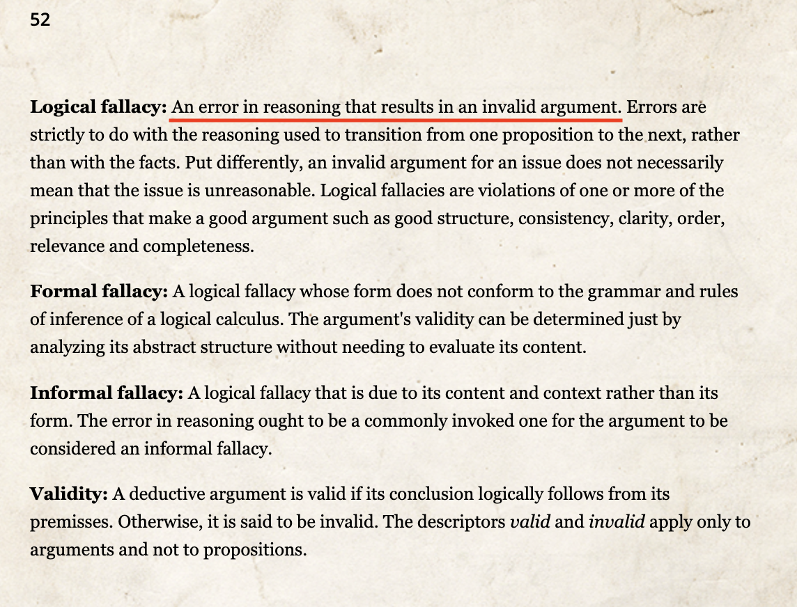
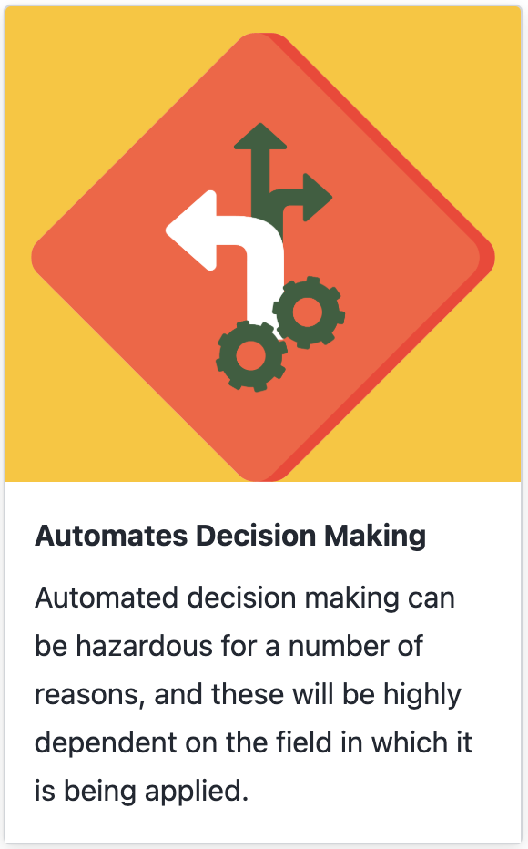

   

# Have you ever seen a confusing or misleading data visualization on social media?

notes:
**ask for a raise of hands**

now is your chance to complain (but in a structured way, and with slides :D)

---

Bad arguments are not difficult to find in social media.  After reading <a href="https://bookofbadarguments.com/">An Illustrated Book of Bad Arguments by Almossawi</a> and reviewing the <a href="https://datahazards.com/labels.html">Data Hazards website</a>, students will identify a "bad argument" in social media (tweet, post, etc.) that uses data or data visualization. This will be an oral presentation with slides. Specifically, you will make a 5-7 minute presentation with 3–5 slides (presentation dates will be assigned) to answer the question: What makes this argument bad and what are the data hazards?

-- The Syllabus

notes:
So, let's go through the description of the assignment in some detail.

As we just discussed, we know that bad arguments are not hard to come by on social media.  In groups, you're going to investigate this in a structured way.

**be aware** while this is called a "Tweet Critique" this is mostly because its a fun sounding name -- you can use posts from Twitter (or X or whatever), Mastadon, Reddit, etc

---

Bad arguments are not difficult to find in social media.  After reading <a href="https://bookofbadarguments.com/">An Illustrated Book of Bad Arguments by Almossawi</a> and reviewing the <a href="https://datahazards.com/labels.html">Data Hazards website</a>, students will identify a "bad argument" in social media (tweet, post, etc.) that uses data or data visualization. This will be an oral presentation with slides. Specifically, you will make a 5-7 minute presentation with 3–5 slides (presentation dates will be assigned) to answer the question: What makes this argument bad and what are the data hazards?

-- The Syllabus

notes:
The next part of the description mentions the "Book of Bad Arguments" and the "Data Hazards" website, so let's look at those.

---

## The Illustrated Book of Bad Arguments

notes:
the first tool we'll be using is the online illustrated book of bad arguments which has a set of examples of common *logical fallacies* which are illustrated with (in my opinion) wonderfully creepy animal pictures

---

## The Illustrated Book of Bad Arguments

[https://bookofbadarguments.com](https://bookofbadarguments.com)

notes:
be sure to check out the back few pages of the book in order to see some important definitions, including...

---

## The Illustrated Book of Bad Arguments

[https://bookofbadarguments.com](https://bookofbadarguments.com)

notes:
... the logical fallacies you'll want to draw from to see which apply to your particular "tweet".  These are basically an error in reasoning which leads to a faulty argument (see their formal definition of an argument)...

---

## The Illustrated Book of Bad Arguments

[https://bookofbadarguments.com](https://bookofbadarguments.com)

notes:
... there are many reasons that one can make an error in reasoning including **read the list** and this book gives a quick overview of several common errors.

---

## Data Hazard Labels

[https://datahazards.com/labels.html](https://datahazards.com/labels.html)

notes:
In addition to logical fallacies, you'll be pulling from the Data Hazards Labels, which have direct implications for using data in various ways, including in visualizations aimed at the public on social media. 

Here are just two examples **read** but there are several others which might apply to the data shown in your chosen social media post.

---

Bad arguments are not difficult to find in social media.  After reading <a href="https://bookofbadarguments.com/">An Illustrated Book of Bad Arguments by Almossawi</a> and reviewing the <a href="https://datahazards.com/labels.html">Data Hazards website</a>, students will identify a "bad argument" in social media (tweet, post, etc.) that uses data or data visualization. This will be an oral presentation with slides. Specifically, you will make a 5-7 minute presentation with 3–5 slides (presentation dates will be assigned) to answer the question: What makes this argument bad and what are the data hazards?

-- The Syllabus

notes:
Ok, so coming back to the assignment description...

---

Bad arguments are not difficult to find in social media.  After reading <a href="https://bookofbadarguments.com/">An Illustrated Book of Bad Arguments by Almossawi</a> and reviewing the <a href="https://datahazards.com/labels.html">Data Hazards website</a>, students will identify a "bad argument" in social media (tweet, post, etc.) that uses data or data visualization. This will be an oral presentation with slides. Specifically, you will make a 5-7 minute presentation with 3–5 slides (presentation dates will be assigned) to answer the question: What makes this argument bad and what are the data hazards?

-- The Syllabus

notes:
... after reading the Book of Bad Arguments and the Data Hazards Labels, you'll have a better idea of what you are looking for for your particular "bad argument" social media post.   

You just need to find one post using data or a data visualization -- but be sure to check the rubric for the assignment as this will likely be easier to do with a post that has some data visualization in the tweet

---

Bad arguments are not difficult to find in social media.  After reading <a href="https://bookofbadarguments.com/">An Illustrated Book of Bad Arguments by Almossawi</a> and reviewing the <a href="https://datahazards.com/labels.html">Data Hazards website</a>, students will identify a "bad argument" in social media (tweet, post, etc.) that uses data or data visualization. This will be an oral presentation with slides. Specifically, you will make a 5-7 minute presentation with 3–5 slides (presentation dates will be assigned) to answer the question: What makes this argument bad and what are the data hazards?

-- The Syllabus

notes:
After finding your post with the "bad argument" viz, you'll make a presentation with your group with roughly 3-5 slides, over about 5-7 minutes which...

---

Bad arguments are not difficult to find in social media.  After reading <a href="https://bookofbadarguments.com/">An Illustrated Book of Bad Arguments by Almossawi</a> and reviewing the <a href="https://datahazards.com/labels.html">Data Hazards website</a>, students will identify a "bad argument" in social media (tweet, post, etc.) that uses data or data visualization. This will be an oral presentation with slides. Specifically, you will make a 5-7 minute presentation with 3–5 slides (presentation dates will be assigned) to answer the question: What makes this argument bad and what are the data hazards?

-- The Syllabus

notes:
... clearly demonstrates what makes the argument bad (i.e. which logical fallacy(s) are present) and which data hazard(s) are at play?

---

## Step by step, students will:

notes:
in summary, for this assignment in your groups you will...

---

## Step by step, students will:
1. identify a "bad argument" in social media (tweet, post, etc.) that uses data or data visualization,

notes:
**read**

---

## Step by step, students will:
1. identify a "bad argument" in social media (tweet, post, etc.) that uses data or data visualization,
2. make a copy of it (with proper citation of authorship, where found, when posted),

notes:
**read**

---

## Step by step, students will:
1. identify a "bad argument" in social media (tweet, post, etc.) that uses data or data visualization,
2. make a copy of it (with proper citation of authorship, where found, when posted),
3. explain what makes it a bad argument (logical fallacies *and* data hazards present), and

notes:
**read**

---

## Step by step, students will:
1. identify a "bad argument" in social media (tweet, post, etc.) that uses data or data visualization,
2. make a copy of it (with proper citation of authorship, where found, when posted),
3. explain what makes it a bad argument (logical fallacies *and* data hazards present), and
4. analyze the tweet (words, image, source, context, etc.) in a 5-7 minute in-class presentation.

notes:
**read**

---

## Step by step, students will:
1. identify a "bad argument" in social media (tweet, post, etc.) that uses data or data visualization,
2. make a copy of it (with proper citation of authorship, where found, when posted),
3. explain what makes it a bad argument (logical fallacies *and* data hazards present), and
4. analyze the tweet (words, image, source, context, etc.) in a 5-7 minute in-class presentation.

Please include the original tweet in your paper or presentation slides.

notes:
**read**

---

## Tweet Critiques: Things we’re looking for

notes:
if you check out the rubric for this assignment (it is linked on Canvas), you'll see there are a few things we are looking for

---

## Tweet Critiques: Things we’re looking for

1. Clarity: Is the bad argument clearly explained? 

notes:
First, you want to fully be able to explain the argument that is being made in the social media post you are showing.

How will you make sure your audience is following this?

---

## Tweet Critiques: Things we’re looking for

1. Clarity: Is the bad argument clearly explained? 
1. Data visualization: is the problematic visualization included and explained? 

notes:
You will also want to make sure your audience (us) can fully follow *why* the visualization is problematic.

This can be tricky with confusing visualizations, so you will have to spend some some time carefully considering how you'll make the issues with the confusing visualization clear to your audience. 

---

## Tweet Critiques: Things we’re looking for

1. Clarity: Is the bad argument clearly explained? 
1. Data visualization: is the problematic visualization included and explained? 
1. Analysis: Is the bad argument analyzed, in relation to the categories of bad arguments from Almossawi and anything else that makes this bad? 

notes:
You'll want to clearly explain which of the logical fallacies apply to your chosen social media post.

---

## Tweet Critiques: Things we’re looking for

1. Clarity: Is the bad argument clearly explained? 
1. Data visualization: is the problematic visualization included and explained? 
1. Analysis: Is the bad argument analyzed, in relation to the categories of bad arguments from Almossawi and anything else that makes this bad? 
1. Analysis: Is the appropriate Data Hazard Label discussed in relation to the data used in the visualization presented? 

notes:
You'll also want to pick out which of the data hazard labels apply to your post as well.

---

## Tweet Critiques: Things we’re looking for

1. Clarity: Is the bad argument clearly explained? 
1. Data visualization: is the problematic visualization included and explained? 
1. Analysis: Is the bad argument analyzed, in relation to the categories of bad arguments from Almossawi and anything else that makes this bad? 
1. Analysis: Is the appropriate Data Hazard Label discussed in relation to the data used in the visualization presented? 
1. Audience engagement: Is there a clear strategy for engaging the audience in the presentation? 

notes:
Finally, we want you to think a bit about how to keep your audience engaged in your presentation.

We'll talk about specific strategies as we go along in the class, but we want you to start thinking about this now.

---

