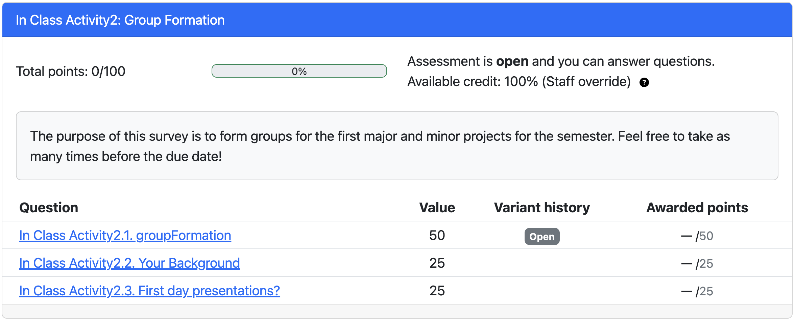
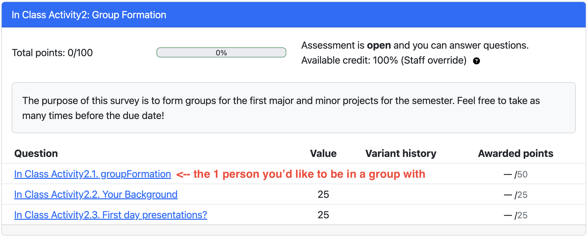
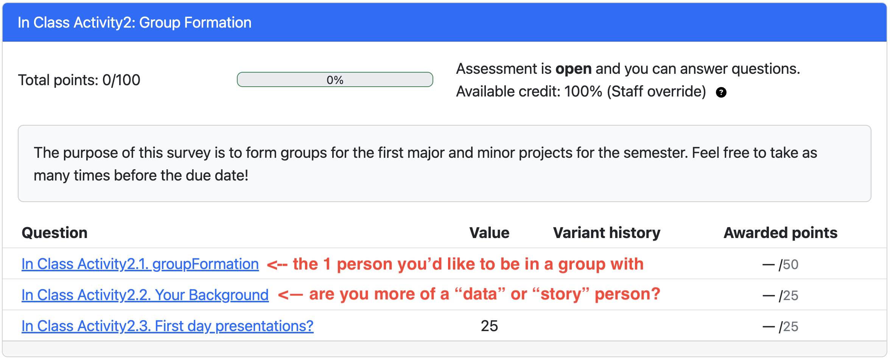
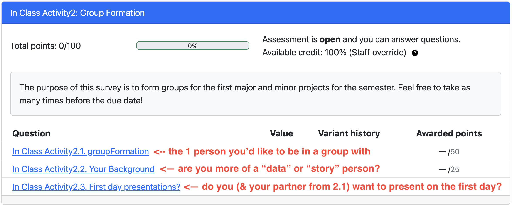
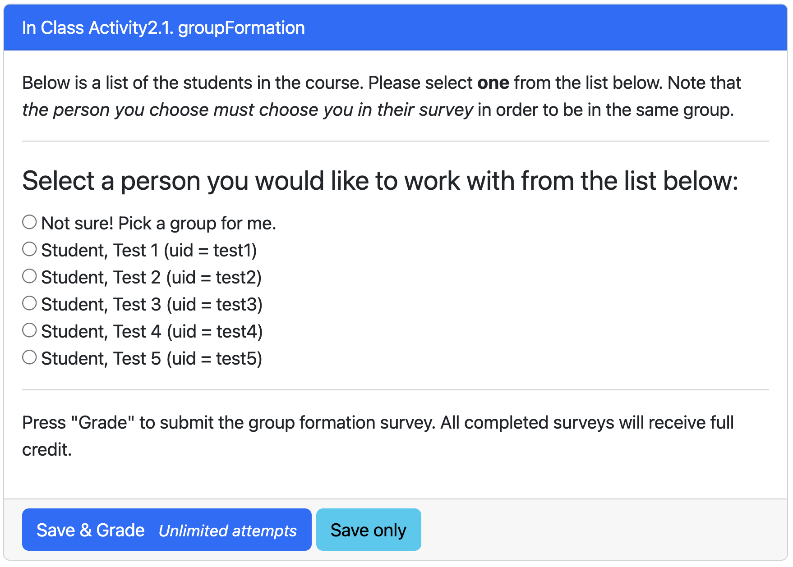
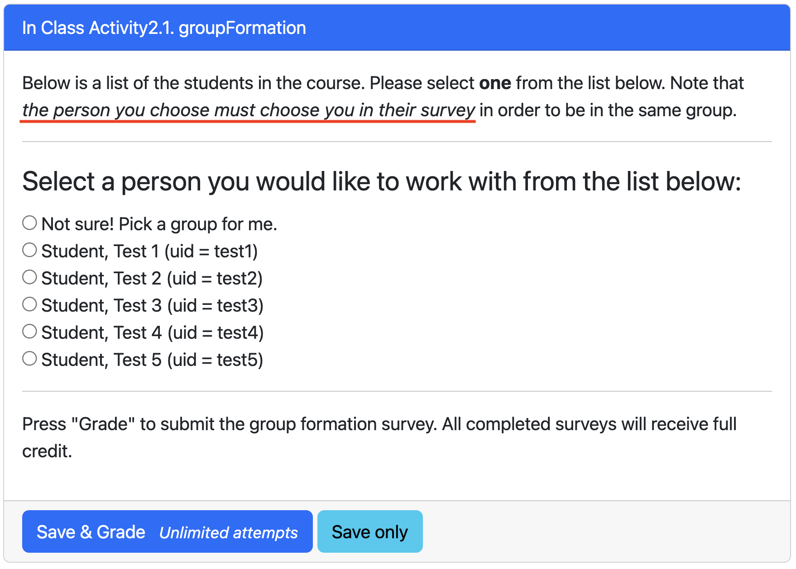

   

# Groups!

notes:
part of working in academia or industry is the ability to work as a team

we'll have several opportunities to do this, with different groups of folks in this class

and we'll scaffold you through the process of working together as well

---

## Group Set 1 (MP1 & MiP1)

Group formation will be using the ["astromimicry" concept](https://arxiv.org/pdf/2203.11218.pdf).

notes:

groups will be a combination of your selection and randomly assigned, following concepts of "astromimicry"

the basic idea is that for this first group, you get to choose one person you want to work with and then we randomly assign you to a group with other folks in this "binary star" configuration

---

## Group Set 1 (MP1 & MiP1)

Group formation will be using the ["astromimicry" concept](https://arxiv.org/pdf/2203.11218.pdf).

Group size: ~4 people per group.

notes:

size of groups will be about 4 people, it will depend a bit on the final size of the class after 10th day

---

## Group Set 1 (MP1 & MiP1)

Group formation will be using the ["astromimicry" concept](https://arxiv.org/pdf/2203.11218.pdf).

Group size: ~4 people per group.

Design of group contracts will be part of an in class activity.

notes:

there will be an in class activity next week aimed at cementing the ways in which you will be working in a group -- i.e. how the group will communicate, how work will be divided, etc

---

## Group Formation "Activity"

notes:

the group formation activity will be part of a PL quiz, but will count as an "in class" activity.

to get points for this you need to fill out all of the questions in the survey

overview of the choices in the quiz are...

---

## Group Formation "Activity"

notes:

---

## Group Formation "Activity"

notes:

---

## Group Formation "Activity"

notes:

---

## Group Formation "Activity"

notes:
what you'll see on the first question will be a list of people + UID's that are enrolled in the course

you can choose to have us just place you in a group OR you can select one person from this list

---

## Group Formation "Activity"

notes:
**be aware** the person you pick has to pick you back in order to be in the same group

so, for example, if you pick someone and the person you pick picks someone back, that doesn't mean you'll 3 be in a group together, that means we'll pick randomly for you

---

* timeline for this
* table of assignments and their groups
* how other groups will be formed