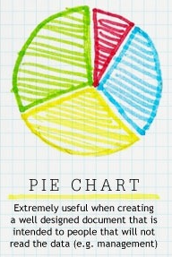
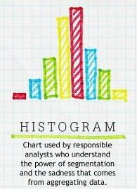

   
# Designing a Good Viz

notes:

How do we design a good viz?  Will go through some "best practices", but be warned it will also take a bit of practice.

How to make a good viz:
1. Part 1: choosing your viz
  * mini perception channels
  * data --> viz, types of viz
  * include "types of viz image"
  * look at types of viz webpage

2. Part 2: designing your viz
  * some of tufte
  * go through caveats webpage

---

## Perception Channels

<table>
<tr>
<td> Closure</td>
<td> Color</td>
<td> Size</td>
<td> Density</td>
<td> Curvature</td>
</tr>
<tr>
<td> Intensity</td>
<td> Orientation</td>
<td> Depth Cues</td>
<td> Intersection</td>
<td> Terminators</td>
</tr>
</table>

Check out [sc2.ncsu.edu/faculty/healey/PP](sc2.ncsu.edu/faculty/healey/PP) for more examples and research.

notes:

so this is a bit of a repeat of things covered in IS445, the Data Viz class for those who have taken it or plan on taking it, but at a very basic level -- there are different kinds of "channels" through which humans can perceive representations of data

some of these channels are more/less effective at conveying information -- which of these "pop out" the most to you?

---

## Preattentive Processing

Which image has the red dot?

<!-- .slide: class="two-floating-elements" -->

  

 

Check out [sc2.ncsu.edu/faculty/healey/PP](sc2.ncsu.edu/faculty/healey/PP) for more examples and research.

notes:
there are several very powerful perception channels like color which is a "preattentive attribute" -- this means that our brain can sense changes in color before we have to actively focus on an image

this is why you probably immediately saw which of these images had a red dot in it

---

## Strength of Perception Channels

<!-- .slide: data-background-image="images/perception_channels/stevensLaw.png" data-background-size="auto 75%" -->

notes:
different perception channels map more or less "truthfully" to data -- a fun example is shown here

for example we can see that there is about a 1-to-1 correspondence between the physical length of an object and our perceived length of the object

while for something like area our perception is much less sensitive

this is why something like a bar chart is typically a better way to communicate with data than a pie chart

also, don't try to visualize data with electric shocks please! :D

---

## Perception Channels to Data Encodings

<!-- .slide: data-background-image="images/perception_channels/vad_slides_p51.png" data-background-size="auto 75%" -->

notes:
we can map the effectiveness of different perception channels roughly to the kinds of marks we want to make for different kinds of data

for example, for ordered data like quantitative or ordered categorical something like position on a common scale (i.e. a bar chart) is at the top, 

while something like volume (i.e. a 3D chart) is on the bottom

---

## What kinds of plots should we use with what kinds of data?

notes:
so, the natural next question would probably be, what kinds of precise plots should we use with a particular kind of data?  like a set of time varying points or a bunch of categorical variables?

---

## What kinds of plots should we use with what kinds of data?

notes:
the short answer, is it depends but you'll definitely find suggestions from various folks out there

for example, this is a pretty silly chart...

---

## What kinds of plots should we use with what kinds of data?

<!--

  

-->

Caption: Extremely useful when creating a well designed document that is intended to people that will not read the data (e.g. management)

notes:
for example, it suggests that pie charts are good for management since that is a chart they are used to seeing...

---

## What kinds of plots should we use with what kinds of data?

Caption: Chart used by responsible analysts who understand the power of segmentation and the sadness that comes from aggregating data.

notes:
and suggests something like a histogram/barchart is for use by very serious analysts :D

---

<embed src="https://www.data-to-viz.com/#spider" style="width:100%; height:80vh">

---

<embed src="https://www.data-to-viz.com/caveats.html" style="width:100%; height:80vh">
