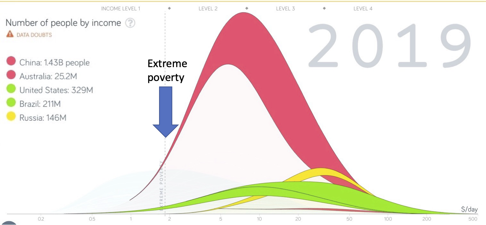

## Reminder: Guest lecturers for the remaining weeks

notes:
gone, etc, who is taking over and a bit about them

---

## Schedule of Guest Lecturer Dates

<table border="0">
    <thead>
        <tr>
            <th style='width:20%'>Week</th>
            <th>Guest Lecturer</th>
            <th>Topic</th>
        </tr>
    </thead>
    <tbody>
        <tr>
            <td style='width:20%'>Week 12 (4/7)</td>
            <td>Prof. Christy Moss</td>
            <td>Community Data Stories (Day 1)</td>
        </tr>
        <tr>
            <td style='width:20%'>Week 13 (4/14)</td>
            <td>Prof. Christy Moss</td>
            <td>Community Data Stories (Day 2)</td>
        </tr>
        <tr>
            <td style='width:20%'>Week 14 (4/21)</td>
            <td>Prof. Kate McDowell</td>
            <td>Storytelling across Industries/Feedback on FDS</td>
        </tr>
        <tr>
            <td style='width:20%'>Week 15 (4/28)</td>
            <td>TA Vibhor!</td>
            <td>FDS Prep</td>
        </tr>
        <tr>
            <td style='width:20%'>Week 16 (5/5)</td>
            <td>Prof. Kate McDowell</td>
            <td>Final Data Stories</td>
        </tr>
    </tbody>
</table>

Final note -- there is one reading quiz in Week 13 who's grade will be uploaded to Canvas by the end of the semester.

---

 
 
 

# Tips to Declutter Slides

notes:
so, during your MP1's and in your feedback you'll notice that we definitely emphasized that slides/viz needs to be clear to your audience.

some folks have already started using arrows/boxes to display these things, but we wanted to give some more examples of these from some "real life" talks

---

## Break down cluttered slides

* Avoid big text blocks
* Break text across multiple slides
* If you need to duplicate a graph/chart, consider annotating the second appearance to direct the audience's attention

---

## "Easy" annotations for graphics (not made by you)

---

## "Easy" annotations for graphics (not made by you)

---

## "Easy" annotations for graphics (not made by you)

---

## "Easy" annotations for graphics (not made by you)

---

## "Easy" annotations for graphics (not made by you)

---

## "Easy" annotations for graphics (not made by you)

---

## "Easy" annotations for graphics (not made by you)

