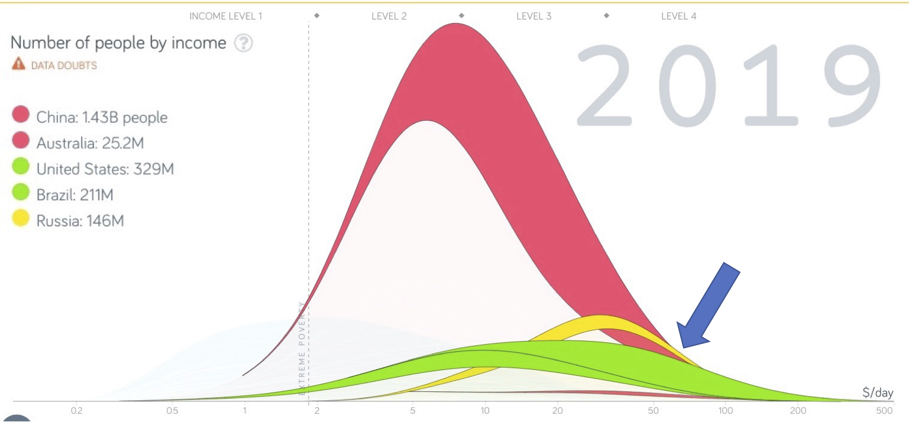
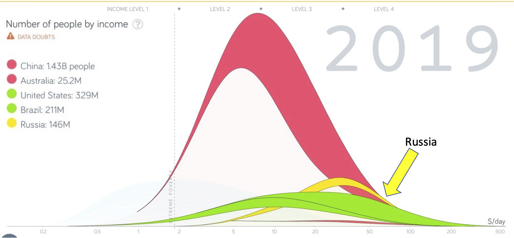

## Reminder: Guest lecturers for the remaining weeks

notes:
gone, etc, who is taking over and a bit about them

---

## Schedule of Guest Lecturer Dates

<table border="0">
    <thead>
        <tr>
            <th style='width:20%'>Week</th>
            <th>Guest Lecturer</th>
            <th>Topic</th>
        </tr>
    </thead>
    <tbody>
        <tr>
            <td style='width:20%'>Week 12 (4/7)</td>
            <td>Prof. Christy Moss</td>
            <td>Community Data Stories (Day 1)</td>
        </tr>
        <tr>
            <td style='width:20%'>Week 13 (4/14)</td>
            <td>Prof. Christy Moss</td>
            <td>Community Data Stories (Day 2)</td>
        </tr>
        <tr>
            <td style='width:20%'>Week 14 (4/21)</td>
            <td>Prof. Kate McDowell</td>
            <td>Storytelling across Industries/Feedback on FDS</td>
        </tr>
        <tr>
            <td style='width:20%'>Week 15 (4/28)</td>
            <td>TA Vibhor!</td>
            <td>FDS Prep</td>
        </tr>
        <tr>
            <td style='width:20%'>Week 16 (5/5)</td>
            <td>Prof. Kate McDowell</td>
            <td>Final Data Stories</td>
        </tr>
    </tbody>
</table>

Final note -- there is one reading quiz in Week 13 who's grade will be uploaded to Canvas by the end of the semester.

---

 
 
 

# Tips to Declutter Slides

notes:
so, during your MP1's and in your feedback you'll notice that we definitely emphasized that slides/viz needs to be clear to your audience.

some folks have already started using arrows/boxes to display these things, but we wanted to give some more examples of these from some "real life" talks

---

## Break down cluttered slides

* Avoid big text blocks
* Break text across multiple slides
* If you need to duplicate a graph/chart, consider annotating the second appearance to direct the audience's attention

notes:
so here are some general "rules of thumb" that Prof. Kate McDowell (who will be working with you all in a few weeks) has used to sort of outline some ways to declutter slides

---

## "Easy" annotations for graphics (not made by you)

notes:
so, the first is some tips for graphs that you might want to include that are not created by you

---

## "Easy" annotations for graphics (not made by you)

Source: [GapMinder](https://www.gapminder.org/)

notes:
for example, here is a screenshot of a graphic made with the gapminder tool

**ask: what are some issues we see with this graphic if we wanted to use it in a talk?**

---

## "Easy" annotations for graphics (not made by you)

Source: [GapMinder](https://www.gapminder.org/)

notes:
one thing we can do is make the text of the legend a bit bigger...

---

## "Easy" annotations for graphics (not made by you)

Source: [GapMinder](https://www.gapminder.org/)

notes:
here, this was done by just a screen grab and enlarging of one section of the graph and just overlaying it on top...

---

## "Easy" annotations for graphics (not made by you)

Source: [GapMinder](https://www.gapminder.org/)

notes:

now there are definitely some other things we'd probably want to change -- for example, we might even consider putting our own text over these labels as they are a little pixelated 

(and we'd probably want to change the colors, and add a y-axis, and make axis labels bigger, etc)

BUT!  This is still MUCH improved from what it was before

---

## "Easy" annotations for graphics (not made by you)

Source: [GapMinder](https://www.gapminder.org/)

notes:
next, we can do things like add visual ques for our audience as we walk them through the graph

after starting by walking our audience through the axis labels and overall meaning of our graph, maybe we want to highlight some aspects of our graph

for example, let's say I want folks to focus on where Russia is in this graph, I can add an arrow

---

## "Easy" annotations for graphics (not made by you)

Source: [GapMinder](https://www.gapminder.org/)

notes:
for even more clarity, I can add my own label pointing out Russia here...

---

## "Easy" annotations for graphics (not made by you)

Source: [GapMinder](https://www.gapminder.org/)

notes:
... you might even want to consider color-coding it on that country's color in the graph -- you don't necessarily have to, but this can be effective if you are planning on pointing out multiple countries.

---

## "Easy" annotations for graphics (not made by you)

Source: [GapMinder](https://www.gapminder.org/)

notes:
now let's say I want my audience to pay attention to where the cut-off for "extreme poverty is" -- by moving my arrow, I am now drawing my audience's attention to this line

---

## "Easy" annotations for graphics (not made by you)

Source: [GapMinder](https://www.gapminder.org/)

notes:
since that line is hard to read, I can make sure my audience knows what I'm talking about by adding a label here as well

